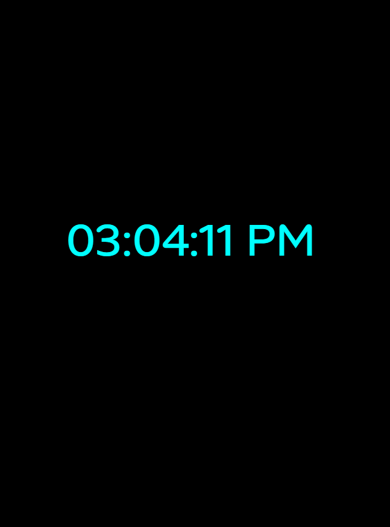

# Digital Clock

A simple **real-time digital clock** built with HTML, CSS, and JavaScript. The clock displays the current time in **12-hour format with AM/PM**, updating every second.

---

## Demo

Here’s how the digital clock looks:



---

## Features

- Displays current time in **HH:MM:SS AM/PM** format.  
- Updates every second to show the real-time clock.  
- Styled with a modern font and visually appealing color scheme.  
- Responsive and centered on the screen.  

---

## Technologies Used

- HTML5  
- CSS3 (with Google Fonts)  
- JavaScript (ES6)

---

## How It Works

1. JavaScript uses the `Date` object to get the current hours, minutes, and seconds.  
2. Converts 24-hour format to 12-hour format with AM/PM.  
3. Adds leading zeros to single-digit hours, minutes, or seconds.  
4. Updates the content of the clock every second using `setTimeout`.  
5. CSS styles the clock for a clean, modern appearance.

---

## Installation

1. Clone the repository:
```bash
git clone https://github.com/Ritupagar12/digital-clock.git
```
2. Navigate to the project folder:
```bash
cd digital-clock
```
3. Open index.html in your browser.
